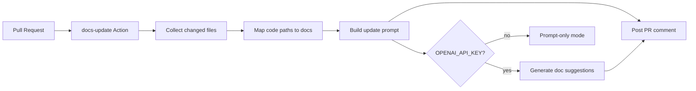

# Payload / Next.js — AI documentation update PoC

Minimal [Payload CMS](https://payloadcms.com) + Next.js app that demonstrates how **code changes on a PR can drive documentation updates**—as a reviewable prompt, and optionally as AI-generated markdown suggestions when an API key is present.

This is meant as a pattern you can port into a real repo’s GitHub Actions.

## What’s included

- Payload 3 + Next.js 15 with **SQLite** (no Docker)
- Collections: `users`, `media`, `posts`
- Dummy docs under [`docs/`](./docs/)
- CLI: `npm run docs:update` (prompt-only or `--apply` with OpenAI)
- Workflow: [`.github/workflows/docs-update.yml`](./.github/workflows/docs-update.yml) posts/updates a PR comment



## Quick start

```bash
cp .env.example .env
npm install
npm run dev
```

- Site: [http://localhost:3000](http://localhost:3000)
- Admin: [http://localhost:3000/admin](http://localhost:3000/admin) (create the first user on first visit)

## Demo: documentation update on a code change

### 1. Make a deliberate schema change

Edit [`src/collections/Posts.ts`](./src/collections/Posts.ts) and add a field, for example:

```ts
{
  name: 'summary',
  type: 'textarea',
},
```

Leave [`docs/collections/posts.md`](./docs/collections/posts.md) unchanged—that gap is the point of the demo.

### 2. Run the CLI locally

```bash
# Prompt-only (no API key required)
npm run docs:update -- --base HEAD

# Or with AI suggestions
export OPENAI_API_KEY=sk-...
npm run docs:update -- --base HEAD --apply
```

Artifacts land in `docs-update-output/`:

| File | Purpose |
|------|---------|
| `prompt.md` | Full LLM prompt (diff + mapped docs + instructions) |
| `comment.md` | Markdown suitable for a PR comment |
| `meta.json` | Machine-readable mapping summary |
| `suggestions/` | Present when `--apply` succeeds |

### 3. See it on a PR

Push a branch and open a PR. The **Docs update check** workflow:

1. Diffs against the PR base branch
2. Maps changed paths → `docs/**` via [`scripts/docs-update/map.ts`](./scripts/docs-update/map.ts)
3. Writes artifacts and **upserts** a PR comment (`<!-- docs-update-bot -->`)
4. If secret `OPENAI_API_KEY` is set, runs with `--apply` and includes AI suggestions in the artifact upload

The workflow does **not** auto-commit doc changes (safer for a PoC). Apply suggestions manually or add a follow-up “open docs PR” step in your real repo.

## Path → doc mapping (defaults)

| Code path | Docs |
|-----------|------|
| `src/collections/Posts*` | `docs/collections/posts.md` |
| `src/app/(payload)/**` | `docs/admin/overview.md` |
| `src/app/(frontend)/**` | posts + admin docs |
| `src/payload.config.ts` | posts, admin, local-setup |
| `package.json` / `.env.example` | `docs/development/local-setup.md` |

Extend mappings in `scripts/docs-update/map.ts` for your monorepo.

## Porting into a real GitHub repo

1. Copy `scripts/docs-update/` and `.github/workflows/docs-update.yml`.
2. Keep (or rewrite) `DOC_MAPPINGS` for your packages and doc tree.
3. Ensure PRs trigger on the paths that matter (`src/**`, packages, etc.).
4. Optionally add repository secret `OPENAI_API_KEY` (and optional variable `OPENAI_MODEL`).
5. Later: add a job that opens a docs-only PR from `docs-update-output/suggestions/` if you want automation beyond comments.

## Scripts

| Script | Description |
|--------|-------------|
| `npm run dev` | Local Payload + Next.js |
| `npm run generate:types` | Regenerate `src/payload-types.ts` |
| `npm run generate:importmap` | Regenerate admin import map |
| `npm run docs:update` | Build docs-update prompt / comment |

## Docs index

See [docs/README.md](./docs/README.md).
